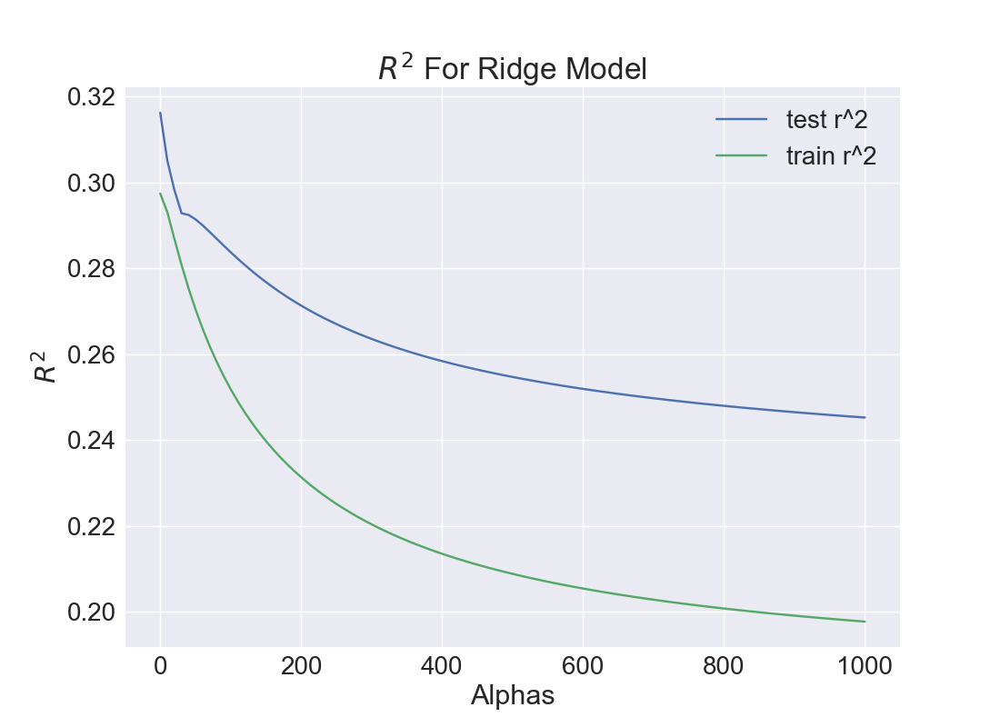
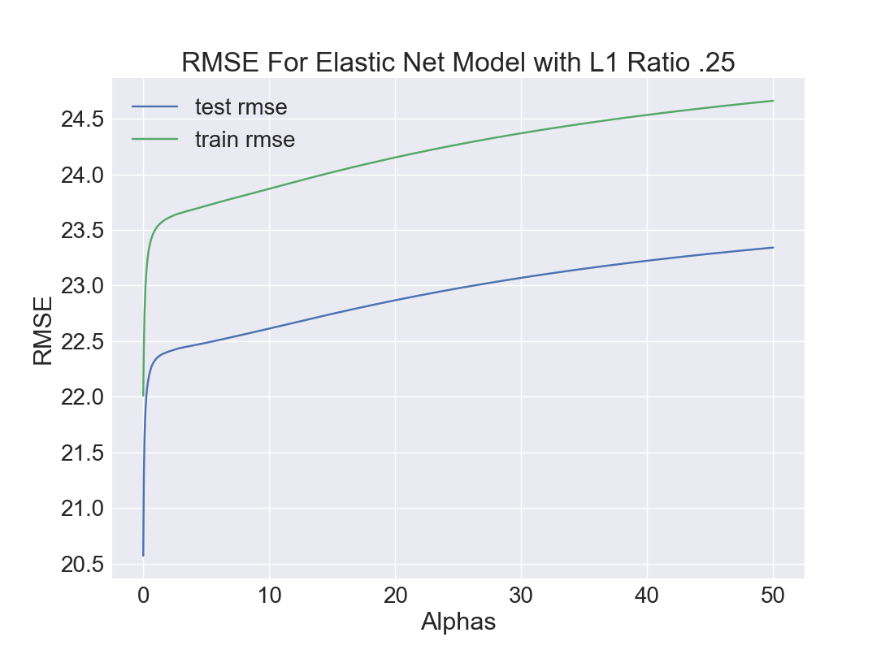

# Predicting Popularity of Spotify Songs

### Question: Can I accurately predict a song's popularity rating on Spotify based on song attributes?

## Data Source
### Spotify API
Spotify makes metadata available through their [API](https://developer.spotify.com/). To interact with the API, I used a python library called [Spotipy](https://github.com/plamere/spotipy). You can see the code I used to pull down data [here](https://github.com/whitneypenn/analytics-capstone/blob/master/src/get_and_clean_data.py)

I used 10 playlists as my sample of songs. I went for playlists curated by journalists, Spotify, and individuals, since I figured that's who's doing most of the curating on Spotify anyways. The 2000s are heavily sampled, since popularity is weighted for music that was listened to recently.

-  [Pitchfork's Top 500 Tracks of the 2000s](https://open.spotify.com/user/pitchforkmedia/playlist/31mWsJSygA2Vx1FyyhXFS4). Spotify's [All Out 00s](https://open.spotify.com/user/spotify/playlist/37i9dQZF1DX4o1oenSJRJd), [Country Gold](https://open.spotify.com/user/spotify/playlist/37i9dQZF1DWYnwbYQ5HnZU), [Rap Caviar](https://open.spotify.com/user/spotify/playlist/37i9dQZF1DX0XUsuxWHRQd), and [The Cookout](https://open.spotify.com/user/spotify/playlist/37i9dQZF1DXab8DipvnuNU). [New York Times Magazine's 2018 Music Playlist](https://open.spotify.com/user/nytmag/playlist/1fIoLrK0POksamXuvzbTee). [Spotifnation's Ultimate Rock Hits of All Time](https://open.spotify.com/user/7jt4w8i9zjsn36sngapjop302/playlist/291drwQ10IlkH0hf1TJcFk). ["Caribou's The Longest Playlist](https://open.spotify.com/user/cariboutheband/playlist/4Dg0J0ICj9kKTGDyFu0Cv4). [Touchepurley's 2017
 Hits](https://open.spotify.com/user/touchepurley/playlist/5cJXS1TnQhldZyI4ObwR7l). [Leonard Partoza Balang's Popular Songs from 2013 to Present](https://open.spotify.com/user/leonardbalang/playlist/0M3Xy7HCXJwPUbQKdOGt51). [Whitney Meer's Ultimate Pop](https://open.spotify.com/user/whitneypenn/playlist/7rpjDLKSDl3eXxUD1rAuMI?si=ZnLP4Nk0Re2yCWJGuLgiow).

## EDA + Feature Engineering
Spotify's Audio Features Object contains information for various metadata fields, outlined in full [here](https://developer.spotify.com/documentation/web-api/reference/tracks/get-audio-features/). Relevant descriptions pulled below.

|  Target   |   Description |
| ---- | ---------- |
| popularity |  The popularity of the track. The value will be between 0 and 100, with 100 being the most popular. Spotify calculates the popularity by algorithm and is based, in the most part, on the total number of plays the track has had and how recent those plays are. |

|  Feature  |  Description |
|--------|-----------|
| acousticness |  A confidence measure from 0.0 to 1.0 of whether the track is acoustic. 1.0 represents high confidence the track is acoustic. |    
| danceability |  Danceability describes how suitable a track is for dancing based on a combination of musical elements including tempo, rhythm stability, beat strength, and overall regularity. A value of 0.0 is least danceable and 1.0 is most danceable. |      
| duration_ms | 	The duration of the track in milliseconds. |
| energy | Energy is a measure from 0.0 to 1.0 and represents a perceptual measure of intensity and activity.  |
| instrumentalness | Predicts whether a track contains no vocals. “Ooh” and “aah” sounds are treated as instrumental in this context. |
| key | The key the track is in.  |
| liveness | Detects the presence of an audience in the recording. Higher liveness values represent an increased probability that the track was performed live. |  
| loudness | The overall loudness of a track in decibels (dB). |
| mode | Mode indicates the modality (major or minor) of a track, the type of scale from which its melodic content is derived. Major is represented by 1 and minor is 0.|
| speechiness | Speechiness detects the presence of spoken words in a track. Values between 0.33 and 0.66 describe tracks that may contain both music and speech, either in sections or layered, including such cases as rap music. |  
| tempo | The overall estimated tempo of a track in beats per minute (BPM). |
| time_signature	| An estimated overall time signature of a track. |
| valence | A measure from 0.0 to 1.0 describing the musical positiveness conveyed by a track. Tracks with high valence sound more positive  | |

#### Distribution of Popularity:

#### Attributes By Popularity

#### Popularity vs (Select) Track Attributes
Selection of the most interesting below, see all of them in the images folder.

## Feature Engineering
1. I turned the "key" attribute into a categorical value. Based on a conversation I had with a music theorist, I decided to give songs in the most popular keys (B, C, G, and E) a value of 1 and all other keys a value of 0.
2. I removed all non-numerical attributes (analysis_url, id, track_href, and uri).
3. After attempting to turn the time signature attribute into a categorial feature, I was still getting an infinite colinearity for those columns, which was resulting in runtime errors, so I decided to remove the features.

Here is my resulting colinearity:

|           Feature       |      VIF |
|-----------------|-------|
| const            | 111.05 |
| acousticness     |   1.53 |
| danceability     |   1.5  |
| duration_ms      |   1.23 |
| energy           |   2.64 |
| instrumentalness |   1.42 |
| liveness         |   1.06 |
| loudness         |   2.63 |
| speechiness      |   1.08 |
| tempo            |   1.07 |
| valence          |   1.48 |
| bceg             |   1.01 |

## Building the Model

I started by quickly using SK Learn's out of the box models. I figured Elastic Net would cover both Ridge and Lasso, and there were no hyper-parameters to tune for OLS, so I moved forward with both of those.

|Model | Train R2 | Test R2| Train RMSE | Test RMSE |
|------| ----------| --------| --- | ---| 
| OLS     | 0.32  |  0.34      |   21.89 | 20.31 |
| Lasso |  0.22  | 0.23 | 23.29 |  22.29 |
| Ridge | 0.32 | 0.34 | 21.89 | 20.32|
| ElasticNet | 0.20 | 0.20 | 23.73 | 22.58 |

### Testing Across Alphas
The plots below show the cross validated max values for R2 and RMSE across varying values of alpha. For Ridge I tested 1000 values of alpha between .01 and 1000, and for ElasticNet I test 1000 values of alpha between .01 and 50.

These plots show us that we are not rewarded for any regularization - the model needs all the data it can get to attempt to fit the model. Notice that our R2 doesn't go above .32 and our RMSE never goes below 20.

### ElasticNet

Again, there is no reward for any regularization. Our R2 doesn't break .3 and RMSE doesn't go below 20.

Note: I did test L1 values for the elastic model, and they were very close. L1 = .25 was marginally the best, but I'm not convinced that it wasn't random.

## Results
At this point, I became convinced that there simply wasn't a linear relationship to be found in this data. I trained an OLS model with all my training data, and pulled Spotify's Today's Top Hits Playlist as my unseen data.

#### OLS Coefficients
|    | Feature                |      Coefficient |
|---:|:-----------------|-------:|
|  1 | acousticness     | -1.892 |
|  2 | danceability     |  2.794 |
|  3 | duration_ms      | -2.143 |
|  4 | energy           | -5.018 |
|  5 | instrumentalness | -6.233 |
|  6 | liveness         | -1.579 |
|  7 | loudness         |  9.597 |
|  8 | speechiness      | -1.929 |
|  9 | tempo            | -1.022 |
| 10 | valence          | -3.412 |
| 11 | bceg             | -1.119 |

Intercept: 44.76

| Model | R2 | RMSE |
| -----| ------------- | ------|
|OLS | -42.03 | 45.31 |

As you can see, the models essentially fail to predict popularity based on unseen data.

I believe that these results are due to the fact that there is no linear relationship between the song attributes I had and the popularity of the song.

## Future Work
With additional data over more time, a relationship might be decipherable. You would probably need more variance in the song attributes across more genres and time periods. I believe My data was representative of pop, country, and rap music -- but there are definitely more (less popular) genres out there. With a wider selection of genres and musical attributes, you could probably get a close approximation of what a pop song's attributes are, and then predict that it would be popular based on genre alone.

With this existing data set, I do believe it would be possible to build a classifier to determine if a song will or won't be popular (depending on your definition of popular).

## References
- Credit to [this blog post](https://opendatascience.com/a-machine-learning-deep-dive-into-my-spotify-data/) on the ODSC Blog by George McIntire for the code that showed me how to pull API Data from Spotify using Spotipy.
- [This StackOverflow Post about how to pull more than 100 songs at a time.](https://stackoverflow.com/questions/39086287/spotipy-how-to-read-more-than-100-tracks-from-a-playlist)
- Chris Albon's [Stacked Bar Plots](https://chrisalbon.com/python/data_visualization/matplotlib_grouped_bar_plot/) blog post.
